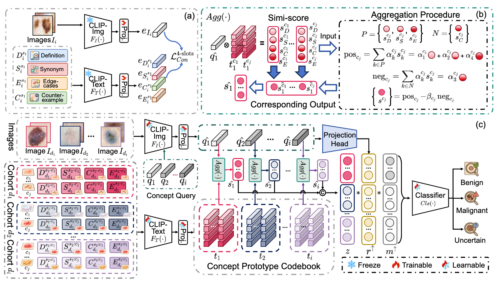
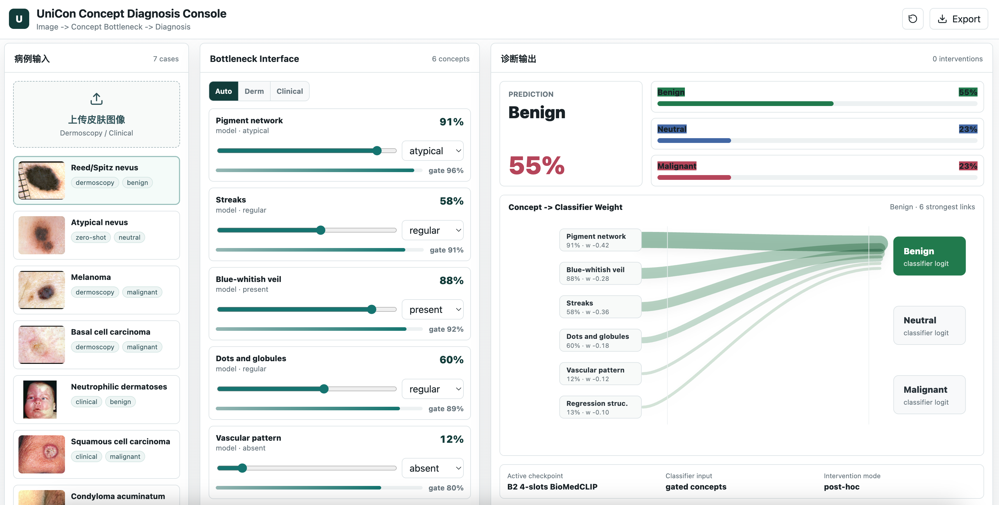

# UniCon: Open-Linguistic Concept Unified Learning for Cross-Site Interpretable Dermatology Diagnosis

This repository contains the research code and visualization demo for **UniCon**, an interpretable dermatology diagnosis framework that connects:

```text
skin image -> concept bottleneck -> diagnosis
```

The project is built around cross-site concept learning for heterogeneous dermatology datasets. It supports dermoscopic concepts from Derm7pt/PH2 and clinical concepts from SkinCon/SkinCAP-style annotations, then exposes the intermediate bottleneck for clinician-facing inspection and intervention.

> Paper: **Open-Linguistic Concept Unified Learning for Cross-site Interpretable Dermatology Image Diagnosis**

## Highlights

- **Unified concept bottleneck** across dermoscopic and clinical image cohorts.
- **Open-linguistic concept specifications** with multi-slot concept text, including description, synonym, edge cases, and counter-example style prompts.
- **BioMedCLIP-based visual-language alignment** for concept representation learning.
- **Three-stage optimization** for concept learning, classifier fitting, and end-to-end fine-tuning.
- **Test-time intervention interface** for editing concept states and observing diagnosis changes.
- **Interactive HTML demo** showing image input, concept bottleneck values, diagnosis probabilities, and Sankey-style concept-to-classifier flow.

## A Quick Overview 




## Online Demo

The visual demonstration website is publicly available at:

[http://47.97.69.173/visual_demo/index.html](http://47.97.69.173/visual_demo/index.html)



The demo provides representative dermatology cases, concept bottleneck visualization, editable concept states, and diagnosis probability outputs for illustrating the UniCon workflow.


## Repository Layout

```text
.

├── model/                           #  UniCon model variants
│   ├── CoPA_B2.py
│   ├── CoPA_4slots.py
│   ├── CoPA_4slots_cluster.py
│   └── CoPA_unify.py
├── train_B2_4slots.py               # main 4-slot unified training entry
├── test_copa_B2.py
├── tti_eval_copa.py                 # test-time intervention evaluation
├── gradcam_copa_B2_4slots.py
├── sankey_plot.py
├── workdir/                         # experiment outputs/checkpoints, not intended for GitHub upload
└── skin_dataset/                    # local dataset folder, not intended for GitHub upload
```

## Data

The project expects a unified metadata CSV and image folders for Derm7pt, PH2, and SkinCAP/SkinCon-style clinical images.

Dataset IDs in `dataset/unified_dataset.py`:

```text
1 -> Derm7pt
2 -> PH2
3 -> SkinCAP / clinical SkinCon-style data
```

The unified CSV should contain at least:

- `dataset_id`
- `diagnosis`
- `three_label`
- `img_path`
- dermoscopic concept columns such as `pigment_network`, `streaks`, `dots_and_globules`, `blue_whitish_veil`
- clinical concept columns such as `Papule`, `Plaque`, `Patch`, `Ulcer`, `Crust`, `Erythema`

Datasets are not redistributed in this repository. Please download each dataset from its official source and follow its license.

## Environment

The original experiments were run with Python/PyTorch and BioMedCLIP-related dependencies. A typical setup is:

```bash
conda create -n unicon python=3.9
conda activate unicon
pip install -r requirements.txt
```

Install the PyTorch build that matches your CUDA environment. For example:

```bash
pip install torch torchvision torchaudio --index-url https://download.pytorch.org/whl/cu121
```

## Training

Main unified 4-slot training:

```bash
python train_B2_4slots.py
```


## Evaluation

Classification/concept evaluation:

```bash
python test_copa_B2.py
```

Test-time intervention evaluation:

```bash
python tti_eval_copa.py
```

Visualization utilities:

```bash
python gradcam_copa_B2_4slots.py
python sankey_plot.py
python tsne_copa.py
```

## Citation

If this code is useful for your research, please cite:

```bibtex
@inproceedings{unicon2026,
  title     = {Open-Linguistic Concept Unified Learning for Cross-site Interpretable Dermatology Image Diagnosis},
  author    = {Anonymous Authors},
  booktitle = {ACM Multimedia},
  year      = {2026}
}
```

## Acknowledgement

This project builds on concept bottleneck modeling, CoPA-style concept prompting/aggregation, BioMedCLIP, and public dermatology datasets including Derm7pt, PH2, and SkinCon/SkinCAP-style clinical annotations.
